# Cálculo de Precipitação + Distribuição Temporal (Método Huff)

Sistema para cálculo de precipitação por isozonas e distribuição temporal de chuvas utilizando o Método de Huff.

---

## 📋 Índice

- [Visão Geral](#visão-geral)
- [Dependências](#dependências)
- [Estrutura de Arquivos](#estrutura-de-arquivos)
- [Arquivos de Entrada](#arquivos-de-entrada)
- [Módulo 1 – Cálculo de Precipitação por Isozonas](#módulo-1--cálculo-de-precipitação-por-isozonas)
- [Módulo 2 – Distribuição Temporal (Huff)](#módulo-2--distribuição-temporal-huff)
- [Menu Principal](#menu-principal)
- [Exemplos de Uso](#exemplos-de-uso)

---

## Visão Geral

O script `Main.py` combina dois módulos:

| Módulo | Função | Entrada | Saída |
|--------|--------|---------|-------|
| ** 1 - Precipitação por Isozonas** | Calcula precipitação para 16 durações e múltiplos tempos de retorno | Coordenadas (lat, lon) + CSV de precipitação | Tabela de precipitação (CSV) |
| ** 2 - Distribuição Temporal (Huff)** | Distribui a precipitação minuto a minuto | CSV de precipitacao (gerado pelo Módulo 1) | CSV com intensidades mm/min |

---

## Dependências

```bash
pip install pandas numpy geopandas shapely
```

| Biblioteca | Uso |
|-----------|-----|
| `pandas` | Manipulação de tabelas (DataFrames) e leitura/escrita de CSV |
| `numpy` | Operações matemáticas (logaritmo, arrays) |
| `geopandas` | Leitura de shapefiles e operações geoespaciais |
| `shapely` | Criação de pontos geográficos para verificação de coordenadas |

---

## Estrutura de Arquivos

```
Trabalho Qgis Areas/
├── Main.py                          # Script principal
├── Data/
│   ├── precipitacao-teste.csv       # CSV de precipitação (entrada)
│   ├── isozonas_coeficientes.csv    # Coeficientes por isozona
│   ├── precipitacao_zona_X.csv      # Saída do Módulo 1
│   └── precipitacao_huff_saida.csv  # Saída do Módulo 2
└── Isozonas_GrausDecimais (1)/
    └── Isozonas_GrausDecimais.shp   # Shapefile com as isozonas
```

---

## Arquivos de Entrada

### `precipitacao-teste.csv` — Dados de Precipitação

O CSV deve conter **apenas 2 colunas** e ser referente a **uma isozona específica**:

| tempo_retorno | precipitacao |
|---------------|-------------|
| 2 | 20.0 |
| 5 | 30.0 |
| 10 | 50.0 |
| 100 | 229.4 |
| 1000 | 350.0 |

- **tempo_retorno**: Período de retorno em anos
- **precipitacao**: Precipitação de 1 dia em mm

> **Nota:** A isozona **não** precisa constar no CSV. O código detecta a isozona pelas coordenadas e utiliza os coeficientes correspondentes.

### `isozonas_coeficientes.csv` — Coeficientes

Contém os coeficientes de conversão para cada isozona:

| isozona | tempo_retorno | coef_1h_24h | coef_6min_24h |
|---------|---------------|-------------|---------------|
| A | 2 | 42.5 | 15.3 |
| A | 5 | 40.1 | 14.8 |
| B | 2 | 38.7 | 13.9 |

- **coef_1h_24h**: Percentual da chuva de 24h que cai em 1 hora
- **coef_6min_24h**: Percentual da chuva de 24h que cai em 6 minutos

---

## Módulo 1 – Cálculo de Precipitação por Isozonas

### Fluxo de Execução



```mermaid
graph TD
    A[Usuário digita lat, lon] --> B[get_isozona: Identifica isozona pelo shapefile]
    B --> C[carregar_dados: Carrega CSV precipitação + coeficientes da zona]
    C --> D[calcular_precipitacao_base: Calcula precip 24h, 1h, 6min]
    D --> E[gerar_tabela: Interpola para 16 durações]
    E --> F[exibir_tabela: Mostra resultados no terminal]
    F --> G[Salva como CSV]
```

### Funções Detalhadas

#### `get_isozona(lat, lon)`
Recebe coordenadas geográficas e retorna a isozona correspondente utilizando o shapefile.

```python
zona = get_isozona(-5.48, -39.2)  # Retorna: "A" (por exemplo)
```

#### `carregar_dados(zona)`
Carrega o CSV de precipitação (2 colunas) e faz merge com os coeficientes da zona detectada:

```
CSV precipitação          Coeficientes zona "A"         Resultado
┌──────────┬────────┐    ┌────────┬─────────┐    ┌──────────┬────────┬─────────┐
│ tempo_ret│ precip │ +  │ coef_1h│ coef_6m │ =  │ tempo_ret│ precip │coef_1h  │
│    2     │  20.0  │    │  42.5  │  15.3   │    │    2     │  20.0  │  42.5   │
│    5     │  30.0  │    │  40.1  │  14.8   │    │    5     │  30.0  │  40.1   │
└──────────┴────────┘    └────────┴─────────┘    └──────────┴────────┴─────────┘
```

#### `calcular_precipitacao_base(df_zona)`
Calcula 3 valores de precipitação base para cada tempo de retorno:

| Cálculo | Fórmula | Descrição |
|---------|---------|-----------|
| `precip_24h` | `precipitacao × 1.14` | Converte chuva de 1 dia → 24 horas |
| `precip_1h` | `precip_24h × coef_1h_24h / 100` | Chuva de 1 hora |
| `precip_6min` | `precip_24h × coef_6min_24h / 100` | Chuva de 6 minutos |

#### `interpolar_precipitacao(duracao_h, p_6min, p_1h, p_24h)`
Interpola a precipitação para qualquer duração entre 6 minutos e 24 horas usando equações logarítmicas:

```
y = a · ln(x) + b
```

| Faixa | Pontos de referência |
|-------|---------------------|
| 6min ≤ d < 1h | Entre `p_6min` (0.1h) e `p_1h` (1h) |
| 1h ≤ d ≤ 24h | Entre `p_1h` (1h) e `p_24h` (24h) |

#### `gerar_tabela(df_base)`
Gera a tabela final com as 16 durações padrão:

| Duração | Horas |
|---------|-------|
| 6 min | 0.1 |
| 10 min | 0.167 |
| 15 min | 0.25 |
| 20 min | 0.333 |
| 25 min | 0.417 |
| 30 min | 0.5 |
| 1 h | 1.0 |
| 2 h | 2.0 |
| 3 h | 3.0 |
| 4 h | 4.0 |
| 6 h | 6.0 |
| 8 h | 8.0 |
| 10 h | 10.0 |
| 12 h | 12.0 |
| 18 h | 18.0 |
| 24 h | 24.0 |

---

## Módulo 2 – Distribuição Temporal (Huff)

### Fluxo de Execução



```mermaid
graph TD
    A[CSV do Módulo 1] --> B[converter_csv_para_huff: Converte formato]
    B --> C["Para cada cenário (TR × duração):"]
    C --> D[distribuir_chuva_huff: Distribui mm por minuto]
    D --> E[processar_csv_huff: Monta tabela final]
    E --> F[exibir_resumo_huff: Mostra resumo]
    F --> G[Salva CSV com intensidades]
```

### Curvas de Huff — Quartis

O método seleciona automaticamente o quartil com base na duração da chuva:

| Duração | Quartil | Pico de intensidade |
|---------|---------|---------------------|
| ≤ 6h | 1º Quartil | ~25% do tempo (início) |
| 6h – 12h | 2º Quartil | ~40% do tempo |
| 12h – 24h | 3º Quartil | ~60% do tempo |
| > 24h | 4º Quartil | ~75% do tempo (final) |

### `calcular_pac_huff(pb, duracao_horas)`
Calcula a **porcentagem acumulada de precipitação** (PAc) dado o tempo decorrido (pb):

- **Entrada**: `pb` = % do tempo decorrido (0 a 100)
- **Saída**: `PAc` = % acumulada da precipitação (0 a 100)

Utiliza polinômios de alto grau ajustados para cada quartil.

### `distribuir_chuva_huff(precipitacao_mm, duracao_horas)`
Distribui a precipitação total minuto a minuto:

```
Exemplo: 100mm em 2 horas (120 minutos)

Minuto 1:  pb=0.83%  → PAc=0.5%  → acum=0.5mm  → intensidade=0.5mm
Minuto 2:  pb=1.67%  → PAc=1.2%  → acum=1.2mm  → intensidade=0.7mm (1.2 - 0.5)
Minuto 3:  pb=2.50%  → PAc=2.0%  → acum=2.0mm  → intensidade=0.8mm (2.0 - 1.2)
Minuto 4:  pb=3.33%  → PAc=2.9%  → acum=2.9mm  → intensidade=0.9mm (2.9 - 2.0)
   ...
Minuto 60: pb=50%    → PAc=70%   → acum=70mm   → intensidade=2.0mm (pico)
   ...
Minuto 120: pb=100%  → PAc=100%  → acum=100mm  → intensidade=0.3mm
```

A intensidade de cada minuto é calculada subtraindo o acumulado do minuto anterior.

### Formato de Saída (CSV Huff)

```
minuto;2,6min;2,10min;...;100,1h;...;1000,24h
1;0.0012;0.0015;...;0.0234;...;0.0567
2;0.0014;0.0018;...;0.0267;...;0.0601
...
1440;0.0001;0.0002;...;0.0003;...;0.0004
```

Cada coluna segue o padrão `TR,duração` (ex: `100,6min` = tempo de retorno 100 anos, duração 6 minutos).

---

## Menu Principal

```
======================================================================
   SISTEMA DE CÁLCULO DE PRECIPITAÇÃO + DISTRIBUIÇÃO TEMPORAL
======================================================================

   Opções:
   [1] Cálculo de Precipitação por Isozonas
   [2] Distribuição Temporal - Método Huff
   [3] Executar os dois (Encadeado)
   [0] Sair

----------------------------------------------------------------------
```

| Opção | Descrição |
|-------|-----------|
| **[1]** | Solicita coordenadas → calcula precipitação → opção de salvar CSV |
| **[2]** | Lê CSV do Módulo 1 → distribui por Huff → salva CSV com intensidades |
| **[3]** | Executa [1] automaticamente → usa saída como entrada de [2] |
| **[0]** | Encerra o programa |

---

## Exemplos de Uso

### Executar o script
```bash
python Main.py
```

### Opção 1 — Cálculo de Precipitação
```
Digite a latitude: -5.48
Digite a longitude: -39.2

Zona identificada: A

==============================================================================
TABELA DE PRECIPITAÇÃO (mm)
Coordenadas: (-5.48, -39.2) - Zona: A
==============================================================================
Duração        TR 2      TR 5     TR 10   ...
------------------------------------------------------------------------------
6 min          5.23      7.84     13.07   ...
10 min         6.78     10.15     16.92   ...
...
24 h          22.80     34.20     57.00   ...
==============================================================================
```

### Opção 2 — Distribuição Temporal (Huff)
```
======================================================================
   DISTRIBUIÇÃO TEMPORAL - MÉTODO HUFF
======================================================================

Total de cenários processados: 176
Total de linhas (minutos): 1440

Colunas geradas:
    1. 2,6min             | Pmax = 1.60 mm
    2. 2,10min            | Pmax = 3.09 mm
    3. 2,15min            | Pmax = 4.28 mm
    4. 2,1h               | Pmax = 8.34 mm
    ...
   16. 2,24h              | Pmax = 22.80 mm
   17. 5,6min             | Pmax = 2.39 mm
    ...
  176. 10000,24h           | Pmax = 356.80 mm

======================================================================

Arquivo salvo em: Data/precipitacao_huff_saida.csv
```

O CSV de saída contém uma coluna por cenário (TR × duração) com as intensidades em mm/min para cada minuto.

### Opção 3 — Encadeado
Executa automaticamente os dois módulos em sequência:

```
>>> Executando Precipitação + Distribuição (Encadeado) <<<

Digite a latitude: -5.48
Digite a longitude: -39.2

Zona identificada: A

==============================================================================
TABELA DE PRECIPITAÇÃO (mm)
Coordenadas: (-5.48, -39.2) - Zona: A
==============================================================================
Duração        TR 2      TR 5     TR 10   ...
------------------------------------------------------------------------------
6 min          5.23      7.84     13.07   ...
...
24 h          22.80     34.20     57.00   ...
==============================================================================

Arquivo salvo em: ...\Data\precipitacao_zona_A.csv

>>> Iniciando Distribuição Temporal com o arquivo gerado <<<

======================================================================
   DISTRIBUIÇÃO TEMPORAL - MÉTODO HUFF
======================================================================

Total de cenários processados: 176
Total de linhas (minutos): 1440

Colunas geradas:
    1. 2,6min             | Pmax = 1.60 mm
    ...
  176. 10000,24h           | Pmax = 356.80 mm

======================================================================

Arquivo salvo em: Data/precipitacao_huff_saida.csv
```

O Módulo 1 salva o CSV automaticamente, que é usado como entrada do Módulo 2 sem intervenção do usuário.

---

## Configuração

Os caminhos dos arquivos estão definidos no início do `Main.py`:

```python
CSV_COEFICIENTES = r"...\Data\isozonas_coeficientes.csv"
CSV_PRECIPITACAO = r"...\Data\precipitacao-teste.csv"
SHAPEFILE_PATH = r"...\Isozonas_GrausDecimais.shp"
CSV_HUFF_ENTRADA = r"Data/precipitacao_zona_A.csv"
CSV_HUFF_SAIDA = r"Data/precipitacao_huff_saida.csv"
```

> **Importante:** Altere apenas `CSV_PRECIPITACAO` para apontar para seu arquivo de dados. Os demais caminhos não devem ser modificados.
